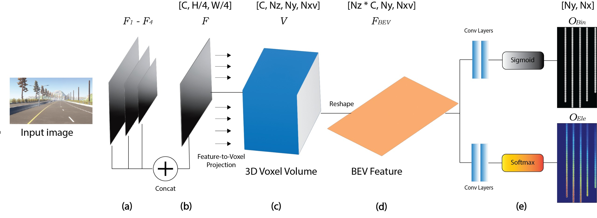

# Voxel3DLane: Adapting Explicit Geometric Voxel Projection for Bird's-Eye-View Monocular 3D Lane Detection

Official implementation of **Voxel3DLane**, a monocular 3D lane detection framework based on explicit geometric voxel projection.

Voxel3DLane is built on top of the MMDetection/OpenMMLab framework.

---
## Framework

<p align="center">

</p>

The framework consists of the following stages:

1. Front-view image feature extraction
2. Explicit voxel projection using camera intrinsics/extrinsics
3. Voxel feature sampling
4. Voxel-to-BEV feature transformation
5. Binary segmentation prediction
6. Elevation prediction
7. Post-processing into 3D lane instances

---
## Installation

### Prerequisites

Voxel3DLane has been tested with the following software versions.

| Component | Version |
| ---------- | ------- |
| Python | 3.9.23 |
| PyTorch | 2.1.0 |
| CUDA | 11.8 |
| MMCV | 2.1.0 |
| MMEngine | 0.10.7 |
| MMDetection | 3.3.0 |

### 1. Clone the repository

```bash
git clone git@github.com:liskibruh/Voxel3DLane.git
cd Voxel3DLane
```

### 2. Create a Conda environment

```bash
conda create -n voxel3dlane python=3.9.23
conda activate voxel3dlane
```

### 3. Install PyTorch

```bash
pip install torch==2.1.0 torchvision==0.16.0 torchaudio==2.1.0 \
    --index-url https://download.pytorch.org/whl/cu118
```

### 4. Install OpenMMLab dependencies

```bash
pip install openmim

mim install mmengine==0.10.7
mim install "mmcv==2.1.0"
mim install "mmdet==3.3.0"
```

### 5. Install the remaining dependencies

```bash
pip install numpy==1.26.4
pip install opencv-python==4.12.0.88
pip install open3d==0.19.0
pip install scikit-image==0.24.0
```

### 6. Verify package versions

Some packages (particularly **NumPy**) may be upgraded automatically during dependency installation. Before proceeding, verify that the installed package versions match the tested environment.

> **Note:** You may see a warning stating that `opencv-python` requires `numpy>=2`. This warning can be safely ignored, as the framework has been tested using `numpy==1.26.4`.

---
## Dataset Preparation

Voxel3DLane is trained and evaluated on the [3D Lane Synthetic Dataset](https://github.com/yuliangguo/3D_Lane_Synthetic_Dataset/tree/master), an extension of the [ApolloSim Synthetic Dataset](https://developer.apollo.auto/synthetic.html).

### 1. Download the dataset

Download the dataset from [Google Drive](https://drive.google.com/file/d/1Kisxoj7mYl1YyA_4xBKTE8GGWiNZVain/view) and extract it under the `data` directory in the project root.

The directory structure should be as follows:

```text
data/
└── Apollo_Sim_3D_Lane_Release
    ├── data_splits
    │   ├── rare_subset
    │   │   ├── train.json
    │   │   └── val.json
    │   └── standard
    │       ├── train.json
    │       └── val.json
    ├── images
    │   └── 00
    │       ├── 0000000.jpg
    │       ├── 0000001.jpg
    │       └── ...
    └── labels
        └── 00
            ├── 0000000.txt
            ├── 0000001.txt
            └── ...
```

### 2. Generate the training and validation splits

Run the following script to generate the dataset splits used by Voxel3DLane:

```bash
python tools/misc/split_apollo3dlanes_data.py
```

Once the script completes, the generated split files will be stored in:

```text
data/Apollo_Sim_3D_Lane_Release/data_splits/lanes_in_cam/
```
---

## Training

Start training with:

```bash
python tools/train_voxel3dlanes.py --config ./mmdet/configs/voxel3dlanes/voxel3dlanes_main_cfg.py
```

## Evaluation

Evaluate a trained model with:

```bash
python tools/test_voxel3dlanes.py --config ./mmdet/configs/voxel3dlanes/voxel3dlanes_main_cfg.py
```
---
## Results

### Detection Scores

| Method | TP | FP | FN | Precision | Recall | F1 Score (\%) ↑ | 
|:--------|:---:|:---:|:---:|:----------:|:--------:|:-----------:|
| **Voxel3DLane** | 5,032 | 1,338 | 1,048 | 0.790 | 0.827 | **80.84** |

### Geometric Accuracy Scores

| Method          | F1 Score ↑ |   X Error ↓ |   Y Error ↓ |
| :---------------: | :---------: | :----------: | :----------: |
| **Voxel3DLane** |  **80.84** | **0.111 m** | **0.097 m** |
---
